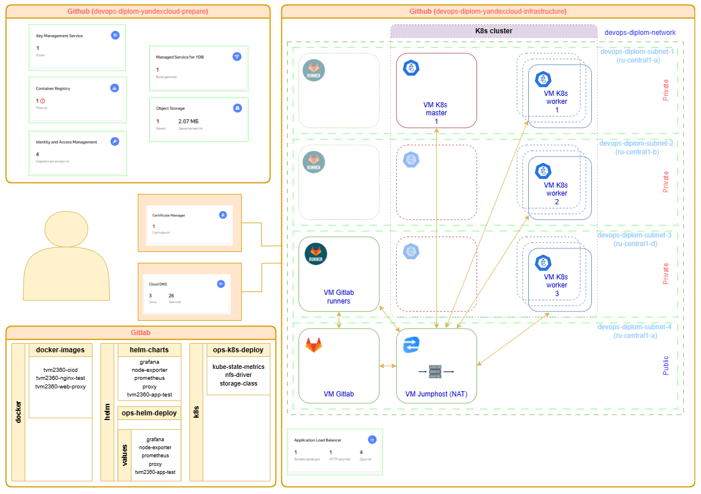

## Дипломный практикум в Yandex.Cloud (devops-diplom-yandexcloud)
---

  * [Описание](#Описание)
  * [Подготовка](#Подготовка)
  * [Разворачивание](#Разворачивание)

---
### Описание
---

В процессе прохождения дипломного практикума в Yandex.Cloud будет развернута инфраструктура, состоящая из:
+ сеть и 4 подсети (3 - приватных в 3 зонах доступности, 1 - публичная)
+ инстанс для разворачивания Gitlab
+ инстанс для разворачивания Jumphost и NAT
+ группы инстансов masters и workers для разворачивания Kubernetes
+ группа инстансов для разворачивания gitlab worker'ов
+ application load balancer, бакендом с целевыми группами которого являются worker ноды kubernetes
+ группы безопасности и прочие компоненты

Разворачивание инфраструктуры происходит c использованием terraform из соответствующих репозиториев Github с использование рабочих процессов: проверки синтаксиса, плана развертывания, а также его применения на инфраструктуре YC.
После разворачивания инфраструктуры, при помощи kubespray будет создан кластер Kubernetes, развернута CI/CD на базе Gitlab.
В Gitlab будут созданы 3 группы репозиториев:
+ docker - группа, содержащая репозитории, предназначенные для создания различныя образов контейнеров docker и их размещения в registry
+ helm - группа, содержащая репозитории с различными версиями чартов helm, для их размещения в registry и дальнейшего развертывания в k8s, а также репозитории helm values
+ kubernetes - группа, содержащая различные функциональные сущности

Схема стенда показана на рисунке:

---
### Подготовка
---

Процесс подготовки перед разворачиванием основной инфраструктуры описана в [devops-diplom-yandexcloud-prepare](https://github.com/tvm2360/devops-diplom-yandexcloud-prepare)

---
### Разворачивание
---

Процесс разворачивания основной инфраструктуры описана в [devops-diplom-yandexcloud-infrastructure](https://github.com/tvm2360/devops-diplom-yandexcloud-infrastructure)

