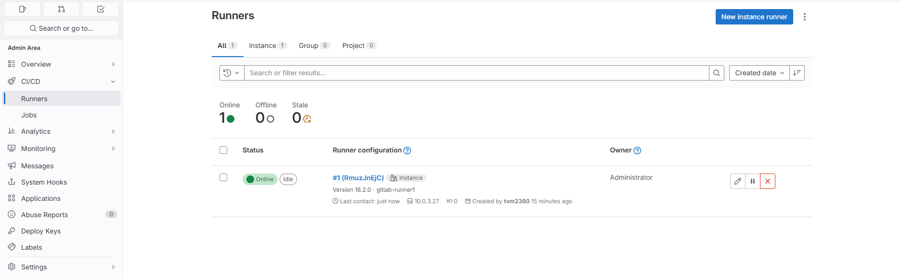
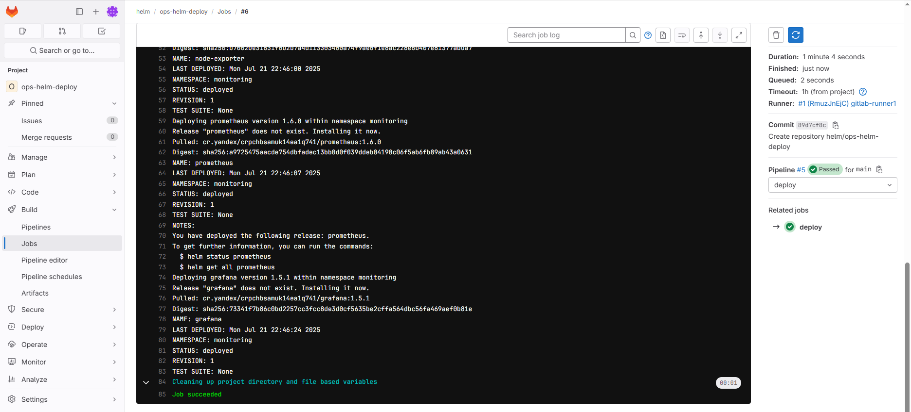

## Дипломный практикум в Yandex.Cloud (devops-diplom-yandexcloud)
---
  * [Описание](#Описание)
  * [Подготовка](#Подготовка)
  * [Разворачивание](#Разворачивание)
  * [Gitlab](#Gitlab)
  * [Тест](#Тест)
  * [Мониторинг](#Мониторинг)
  * [Масштабирование](#Масштабирование)

---
### Описание
---
В процессе прохождения дипломного практикума в Yandex.Cloud будет развернута инфраструктура, состоящая из:
+ сеть и 4 подсети (3 - приватных в 3 зонах доступности, 1 - публичная)
+ инстанс для разворачивания Gitlab
+ инстанс для разворачивания Jumphost и NAT
+ группы инстансов masters и workers для разворачивания Kubernetes
+ группа инстансов для разворачивания gitlab worker'ов
+ application балансировщик с бакендом в виде целевых групп, состоящих  из worker нод kubernetes
+ группы безопасности и прочие компоненты

Разворачивание инфраструктуры происходит c использованием terraform из соответствующих проектов в репозиториях Github с использование рабочих процессов: проверки синтаксиса, плана развертывания, а также его применения на инфраструктуре YC.
После разворачивания инфраструктуры, при помощи kubespray будет создан кластер Kubernetes, развернута CI/CD на базе Gitlab.
В Gitlab будут созданы 3 группы проектов:
+ docker - группа, содержащая проектов, предназначенных для создания различныя образов контейнеров docker и их размещения в registry
+ helm - группа, содержащая проект с различными версиями чартов helm, для их размещения в registry и дальнейшего развертывания в k8s, а также проект helm values
+ kubernetes - группа, содержащая проекты с различными функциональными сущностями K8s

Разворачивание приложений (тест-задания, компонент мониторинга и пр.) будет происходить из Gitlab. Ingress conroller устанавливается при разворачивании кластера k8s.

Схема стенда показана на рисунке:


---
### Подготовка
---
Процесс подготовки перед разворачиванием основной инфраструктуры описан в [devops-diplom-yandexcloud-prepare](https://github.com/tvm2360/devops-diplom-yandexcloud-prepare)

---
### Разворачивание
---
Процесс разворачивания основной инфраструктуры описан в [devops-diplom-yandexcloud-infrastructure](https://github.com/tvm2360/devops-diplom-yandexcloud-infrastructure)

---
### Gitlab
---
Приступаем к настройке Gitlab. Перед первым входом нужно узнать сгенерированный пароль root:
```
ssh -t -i ~/.ssh/id_yc_ed25519 ubuntu@jumphost.tvm2360.ru ssh -i ~/.ssh/id_yc_ed25519_1 ubuntu@<Внутренний IP Gitlab> sudo cat /etc/gitlab/initial_root_password
```
, а также сгенерировать ключ для работы с репозиторием gitlab:
```
ssh-keygen -t ed25519 -C "tvm2360@gitlab.tvm2360.ru" -f ~/.ssh/id_ed25519_gitlab
```
и сразу добавим привязку ключа к хосту в ~/.ssh/config:
```
Host gitlab.tvm2360.ru
   User ubuntu
   IdentityFile ~/.ssh/id_ed25519_gitlab
```
+ ссылки на ключи вставляем свои из [devops-diplom-yandexcloud-infrastructure](https://github.com/tvm2360/devops-diplom-yandexcloud-infrastructure)

Далее входим http://gitlab.tvm2360.ru пользователем root с сгенерированным паролем, который потом можно поменять. Создаем учетную запись с правами админа, устанавиваем ему пароль. Заходим новой УЗ.

Теперь затянем ключ для работы с репозиторием. Заходим Edit Profile -> SSH Keys -> Add new key и в Key вставляем содержимое ```cat ~/.ssh/id_ed25519_gitlab.pub``` без tvm2360@gitlab.tvm2360.ru, в Title tvm2360@gitlab.tvm2360.ru

Далее активируем runner's. Заходим в Admin Area -> CI/CD -> Runners -> New instance runner, платформу выбираем Linux, отмечаем Run untagged jobs, в Runner description вставляем имя раннера, можно имя инстанса (gitlab-runner1) -> Create runner.
Запоминаем токен, заходим через ssh на jumphost и в директорию /opt/gitlab-runners/inventory:
```
ssh jumphost.tvm2360.ru
/opt/gitlab-runners/inventory
```
Там находятся подготовленные файлы с конфигурациями ansible для разворачивания gitlab-runner. Количество фалов соответствует количеству инстансов в группе ig-gitlab-runners. Находим нужную конфигурацию по IP в ansible_host, если runner'ов используется несколько, и в поле gitlab_registration_token вставляем токен.
Как только все токены внесены, возвращаемся на каталог выше и запускаем ansible-playbook:
```
cd ..
./start_reg_runners.sh
exit
```
Ждем окончания процесса...


Возвращаемся в gitlab View Runners - runner подключен и ожидает заданий



Теперь приступаем к настройке переменных окружения. Заходим в Admin Area -> Settings -> CI/CD -> Variables и добавляем (не забывая проверять установленный признак Protect variable):

+ key:CI_REGISTRY type:VARIABLE value:cr.yandex
+ key:CI_REGISTRY_USER type:VARIABLE value:json_key
+ key:CI_REPOSITORY type:VARIABLE value:<вставляем ID реестра devops-diplom-registry>

Для установки значения следующей переменной необходимо сгенерировать ключ сервисного аккаунта sa-devops-diplom-registry-pusher. Для этого:
```
yc iam key create --service-account-name sa-devops-diplom-registry-pusher -o sa-devops-diplom-registry-pusher-key.json
cat sa-devops-diplom-registry-pusher-key.json | base64     -----> вывод копируем в буфер обмена
rm sa-devops-diplom-registry-pusher-key.json
```
+ key:CI_SA_PUSHER_KEY_BASE64 type:FILE value:<вставляем из буфера обмена>

Для установки значения следующей переменной необходимо зайти через ssh на jumphost:
```
ssh jumphost.tvm2360.ru
cat /home/ubuntu/.kube/config | base64      -----> вывод копируем в буфер обмена
```
+ key:CI_KUBE_CONFIG_BASE64 type:FILE value:<вставляем из буфера обмена>


Далее добавляем группы проектов: docker, helm и kubernetes


Теперь начинаем создавать проекты в репозитории Gitlab. Исходные данные находятся в каталоге gitlab-projects, средства загрузки - скрипты:
+ import_project_docker-images.sh
+ import_project_helm-charts.sh
+ import_project_ops-helm-deploy.sh
+ import_project_ops-k8s-deploy.sh

Начинаем с загрузки проекта docker-images группы docker:
```
./import_project_docker-images.sh
```


Сразу после загрузки начнет работать pipeline:


Успешно загруженный проект в репозиторий и прошедший Job:


Результат - образы контейнеров docker в нашем registry:


Далее загружаем проект helm-charts группы helm:
```
./import_project_helm-charts.sh
```

Сразу после загрузки начнет работать pipeline - проверка синтаксиса, упаковка и отправка helm chart в registry:


Успешно загруженный проект в репозиторий:


Результат - образы helm chart в нашем registry:


Теперь загружаем проект ops-k8s-deploy группы kubernetes, в котором содержатся сущности:
+ storage class и controller NFS - обеспечения томов сетевого хранения для pvc и pv
+ сборщик метрик kube-state-metrics для node-exporter

```
./import_project_ops-k8s-deploy.sh
```

Заходим ssh на Jumphost и запускаем утилиту k9s. Проверяем созданные storageclass и pod kube-state-metrics-* в namespace kybe-system:


Перед загрузкой репозитория ops-helm-deploy, в папаках ./gitlab-projects/helm/ops-helm-deploy/values/proxy и ./gitlab-projects/helm/ops-helm-deploy/values/tvm2360-app-test -
в файле values.yaml - в параметре image после cr.yandex меняем ID репозитория. Загружаем проект в репозиторий:

```
./import_project_ops-helm-deploy.sh
```

После загрузки проект запустится pipeline с helm deloy в кластер k8s:



В процессе деплоя helm chart скачиваются с registry, а values с проекта ops-helm-deploy репозитория. В deploy.sh можно переключать версии.

Заходим ssh на Jumphost и запускаем утилиту k9s, проверяем успешность запуска подов приложений в namespace:
+ monitoring:


+ tvm2360:


Заходим в логи любого из pod proxy и проверяем входящий healthcheck трафик от ALB:


Также проверяем состояние в YC GUI:


Логи показывают, что инфраструктура ALB коммуницирует с развернутым в tvm2360 сервисом proxy.

### Тест

В любом браузере заходим на https://tvm2360.ru/test и попадаем на страницу тестового приложения:


### Мониторинг

В любом браузере заходим на https://tvm2360.ru/grafana и попадаем в систему мониторинга Grafana. Первый вход admin/admin, меняем пароль, попадаем на главный экран:


Dashboards загруженные в Grafana:


Основные метрики кластера k8s:


Метрики в разрезе namespace:


Метрики в разрезе pods:


### Масштабирование

Проведем масштабирование Kubernetes. Предположим, что нам понадобился еще одна рабочая нода. Для этого создаем ветку, редактируем ig.auto.tfvars, увеличиваем workers count на единицу:


Создаем коммит, затем PR и анализируем план: в инстанс группу ig-k8s-workers добавляется 4-й инстанс, обновляется kubesparay inventory (добавляется worker4)


Принимаем слияние (Merge PR). Начался применяться план, добавляется VM:


В процессе применения плана запускается kubespray с новыми настройками в inventory:


После окончания применения плана проверяем ноды:


Просматриваем поды в "свежедобавленной" ноде:


Добавлен стандартный набор kube-system, драйвер NFS, контроллер Ingress, сборщик метрик Node-Explorer. В систему мониторинга начали поступать метрики добавленной ноды:


